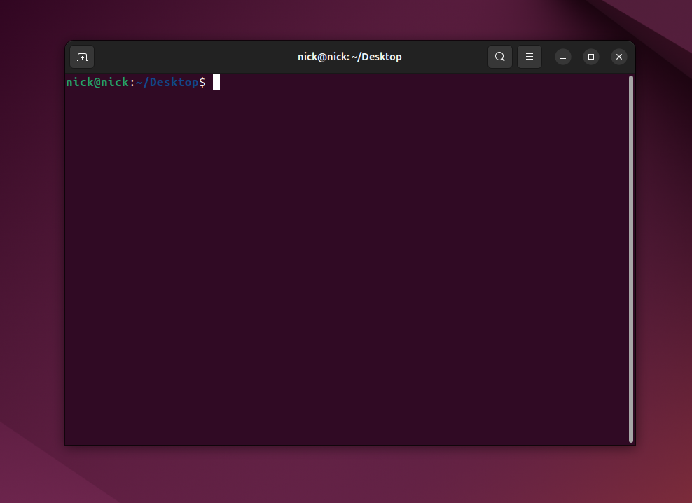
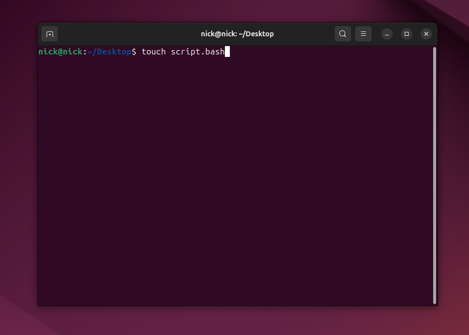
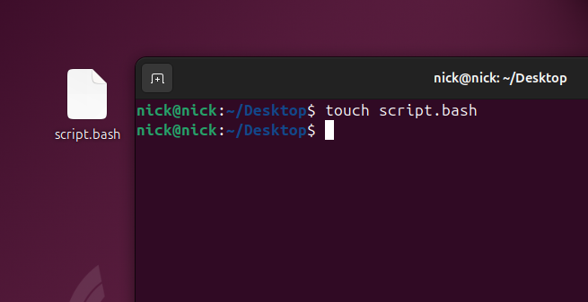
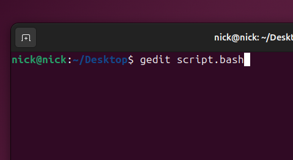
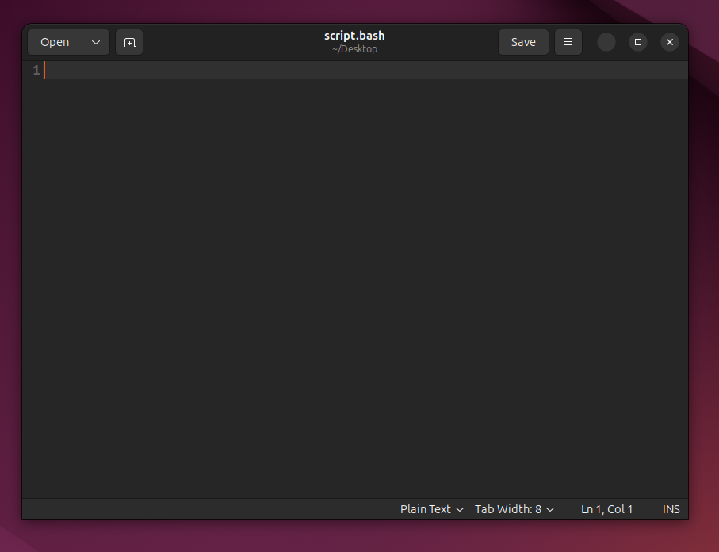
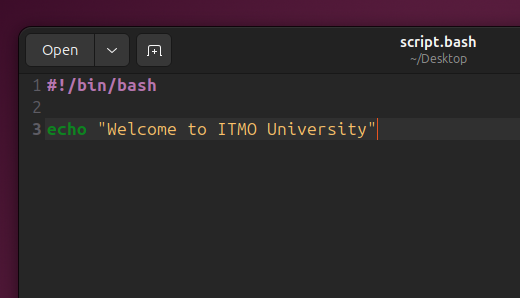
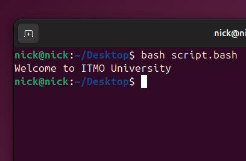
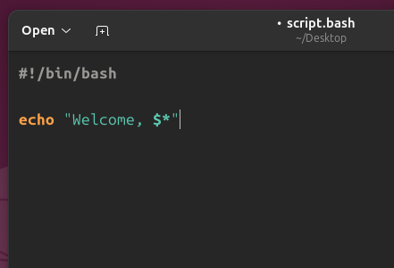
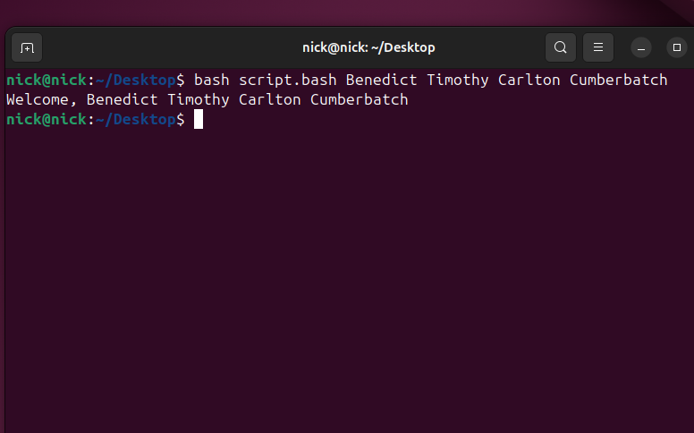

# Отчет по лабораторной работе 1
*Выполнил __Малыхин Никита Сергеевич__* 

## Этап 1. Подготовка

### 1. Открываем терминал на рабочем столе
<div>
  
  
</div>

### 2. Создаем новый файл с именем script.bash
Вводим команду ```touch script.bash```
<div>
  
  
</div>

### 3. Открываем созданный файл
Вводим команду ```gedit script.bash```
<div>
  
  
</div>


### 4. Вводим запрашиваемый скрипт и запускаем его 
```bash
#!/bin/bash

echo "Welcome to ITMO University"
```
<div>
  
  
</div>


## Этап 2. Задача
Модифицируйте файл `script.bash` так, чтобы при его запуске в терминале в виде
```bash
bash script.bash Vasya Pupkin
```
Вывод был `Welcome, Vasya Pupkin`

*Hint:* Скрипт должен работать для любых имен, даже если это Benedict Timothy Carlton Cumberbatch.

### Решение: 


1. Для решения задачи достаточно использовать переменную ```$*```<br>```$*``` — все аргументы (позиционные параметры), в виде одной строки (слова)
2. Таким образом, необходимая нам строка имеет вид ```"Welcome, $*"```
3. Выводим полученную строку с помощью команды ```echo```

Задача решена.

### Примеры:

<div>
  
  
</div>

## Вывод

В данной лабораторной работе я создал bash скрипт с использованием переменной ```$*```, выполняющий вывод аргументов, введенных пользователем при запуске программы
